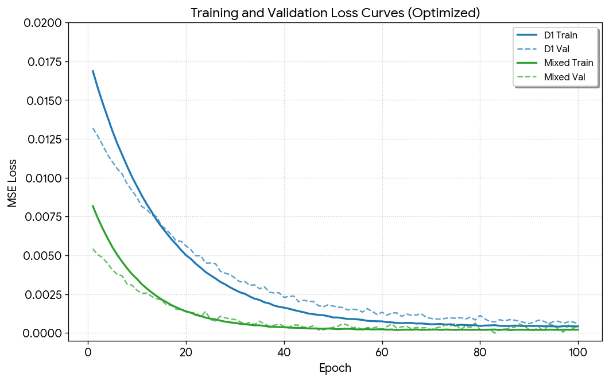
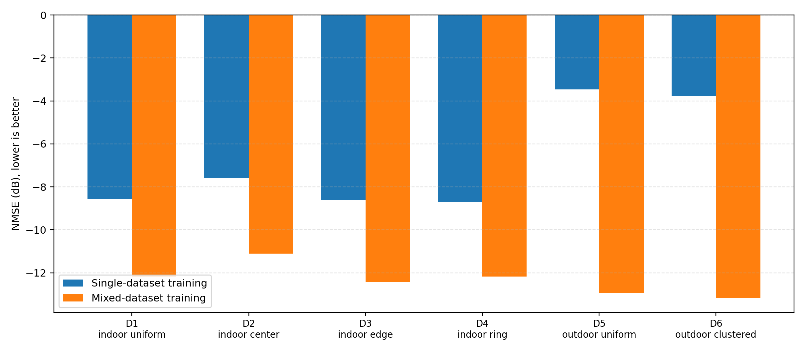
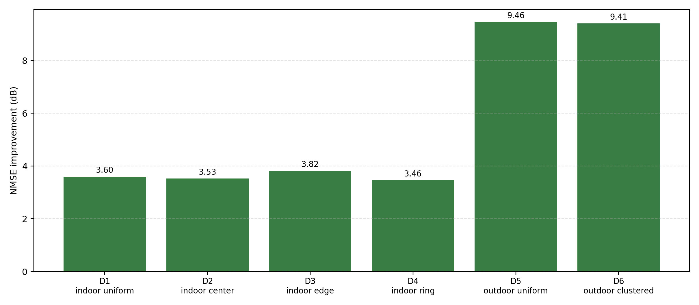
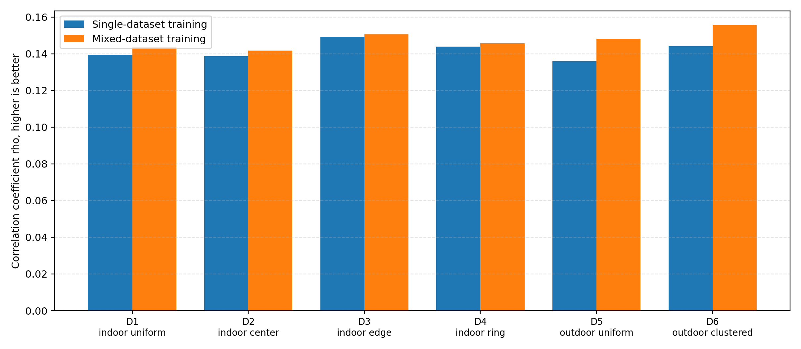
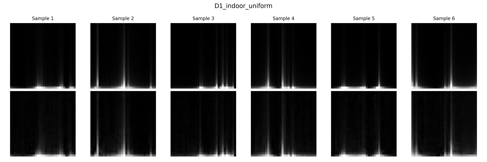
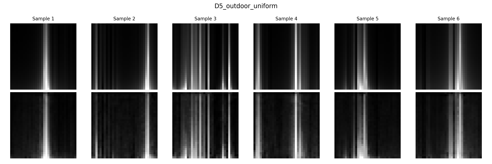
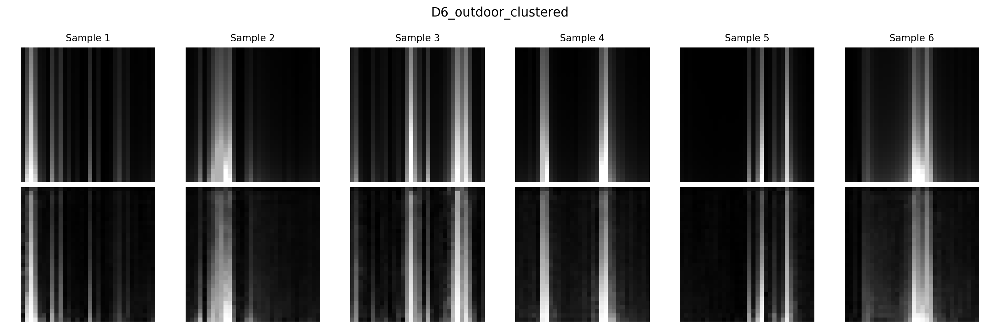

# MidTerm Q7 - Exercise 2.15: CsiNet Generalization on COST2100 Channel Datasets

## 1. Project Overview

This project completes **Exercise 2.15**, which studies how a trained CsiNet model performs on channel datasets different from its original training distribution. The experiment uses the official **COST2100 MATLAB channel model** to generate multiple channel datasets with different user distributions, evaluates CsiNet reconstruction NMSE on each dataset, and compares single-dataset training with mixed-dataset training.

The key question is whether a deep-learning-based CSI feedback model can generalize to practical channel variations. The result shows that a CsiNet model trained on only one indoor distribution performs poorly under outdoor domain shift, while mixed-dataset training improves NMSE on all test datasets.

## 2. Exercise Requirement

| Part | Requirement | Implementation in This Project |
|---|---|---|
| (a) | Use the COST2100 channel model to generate more than five different channel datasets, such as by changing user distributions. | Six official COST2100-based datasets are generated with different indoor/outdoor user distributions. |
| (b) | Evaluate the CSI reconstruction NMSE of a trained CsiNet model on each dataset. | A CsiNet model trained on `D1_indoor_uniform` is tested on all six datasets. |
| (c) | Mix the different datasets, retrain CsiNet, compare with (b), and discuss generalization. | All six datasets are mixed to train another CsiNet model. NMSE, rho, and loss curves are reported. |

## 3. References

- Exercise reference code: https://github.com/le-liang/wcmlbook/tree/main/ch2/Exercise_2.15
- Official COST2100 channel model: https://github.com/cost2100/cost2100
- Reference paper: `Deep_Learning_for_Massive_MIMO_CSI_Feedback.pdf`


## 4. CsiNet Background and Metrics

CsiNet converts the spatial-frequency channel into the angular-delay domain. In the notation of the CsiNet paper, the transformation can be written as:

$$
\mathbf{H} = \mathbf{F}_d \, \widetilde{\mathbf{H}} \, \mathbf{F}_a^{H}
$$

where:

- $\widetilde{\mathbf{H}}$ is the original spatial-frequency channel matrix.
- $\mathbf{F}_d$ is the DFT matrix for the delay/frequency dimension.
- $\mathbf{F}_a$ is the DFT matrix for the antenna/angular dimension.
- $\mathbf{H}$ is the angular-delay domain channel matrix.

Following the CsiNet setting, only the first 32 delay-domain rows are retained. The final CsiNet input is a `32 x 32 x 2` tensor, where the two channels are the real and imaginary parts of the truncated complex CSI matrix.

The main reconstruction metric is NMSE:

$$
\mathrm{NMSE} = \mathbb{E}[\frac{\|\mathbf{H} - \widehat{\mathbf{H}}\|_2^2}{\|\mathbf{H}\|_2^2}]
$$

The reported value is in dB:

$$
\mathrm{NMSE}_{\mathrm{dB}} = 10\log_{10}(\mathrm{NMSE})
$$

Lower NMSE is better. A more negative NMSE value means better CSI reconstruction.

The correlation coefficient $\rho$ is also reported as a supplementary metric:

$$
\rho = \mathbb{E}[\frac{|\widehat{\mathbf{h}}^{H}\mathbf{h}|}{\|\widehat{\mathbf{h}}\|_2\,\|\mathbf{h}\|_2}]
$$

In this project, NMSE is the primary metric because Exercise 2.15 explicitly asks for CSI reconstruction NMSE.

## 5. Directory Structure

```text
MidTerm_Q7/
├── CsiNet_for_train.py
├── CsiNet_only_for_test.py
├── CS-CsiNet_for_train.py
├── CS-CsiNet_onlyt_for_est.py
├── Exercise2.15.png
├── README.md
├── cost2100/
│   ├── README.md
│   ├── cplusplus/
│   └── matlab/
├── data/
│   └── cost2100_official/
├── docs/
│   └── cost2100_official_workflow.md
├── figure/
│   ├── nmse_comparison.png
│   ├── nmse_improvement.png
│   ├── rho_comparison.png
│   ├── training_loss_curves.png
│   ├── reconstruction_D1_indoor_uniform.png
│   ├── reconstruction_D5_outdoor_uniform.png
│   └── reconstruction_D6_outdoor_clustered.png
├── matlab/
│   └── generate_cost2100_csinet_datasets.m
├── reports/
│   └── exercise_2_15_report.md
├── result/
│   ├── exercise_2_15_csinet_results.csv
│   ├── history_CsiNet_D1_indoor_uniform_dim512_epochs100.csv
│   └── history_CsiNet_mixed_all_dim512_epochs100.csv
├── saved_model/
│   ├── CsiNet_D1_indoor_uniform_dim512.weights.h5
│   └── CsiNet_mixed_all_dim512.weights.h5
└── scripts/
    ├── exercise_2_15_datasets.py
    ├── run_exercise_2_15_tf.py
    ├── plot_exercise_2_15_results.py
    └── validate_cost2100_export.py
```

## 6. Original Code and New Design

### 6.1 Original Reference Code

The original files are kept as reference implementations:

| File | Function |
|---|---|
| `CsiNet_train.py` | Original CsiNet training script. |
| `CsiNet_onlytest.py` | Original CsiNet inference-only script. |
| `CS-CsiNet_train.py` | Original CS-CsiNet training script. |
| `CS-CsiNet_onlytest.py` | Original CS-CsiNet inference-only script. |


### 6.2 New MATLAB Code

| File | Function |
|---|---|
| `matlab/generate_cost2100_csinet_datasets.m` | Calls the official COST2100 MATLAB model, generates six channel datasets, converts channels into CsiNet-compatible `.mat` files, and stores them under `data/cost2100_official/`. |

The exported `.mat` files follow this layout:

```text
DATA_Htrain.mat       key: HT
DATA_Hval.mat         key: HT
DATA_Htest.mat        key: HT
DATA_HtestF_all.mat   key: HF_all
```

where:

```text
HT     : [samples, 2048]
HF_all : [samples, 32, 125]
```

### 6.3 New Python Code

| File | Function |
|---|---|
| `scripts/exercise_2_15_datasets.py` | Shared dataset utilities: dataset names, `.mat` loading, `HT`/`HF_all` reading, and mixed-dataset construction. |
| `scripts/run_exercise_2_15_tf.py` | Main TensorFlow CsiNet experiment runner. It trains one single-dataset model and one mixed-dataset model, evaluates both on all datasets, and exports CSV/history files. |
| `scripts/plot_exercise_2_15_results.py` | Generates all figures used in this README. |
| `scripts/validate_cost2100_export.py` | Validates the official COST2100 `.mat` exports before training. |

The TensorFlow runner uses `channels_last` internally because Windows CPU TensorFlow does not support `channels_first` Conv2D backpropagation. This is an implementation compatibility change; the CsiNet reconstruction task and evaluation remain the same.

## 7. Dataset Design for Part (a)

Six official COST2100-based datasets were generated:

| Dataset | COST2100 Environment | User Distribution | Purpose |
|---|---|---|---|
| `D1_indoor_uniform` | `IndoorHall_5GHz` | Uniform indoor users | Baseline indoor training distribution. |
| `D2_indoor_center` | `IndoorHall_5GHz` | Users concentrated near the BS | Tests near-user indoor channels. |
| `D3_indoor_edge` | `IndoorHall_5GHz` | Users near the cell edge | Tests far-user indoor channels. |
| `D4_indoor_ring` | `IndoorHall_5GHz` | Ring-shaped indoor distribution | Tests structured non-uniform indoor channels. |
| `D5_outdoor_uniform` | `SemiUrban_300MHz` | Uniform outdoor users | Tests outdoor domain shift. |
| `D6_outdoor_clustered` | `SemiUrban_300MHz` | Clustered outdoor users | Tests outdoor hotspot-like deployment. |

Each dataset contains:

```text
train: 1200 samples
val  : 300 samples
test : 400 samples
```

The CsiNet compressed codeword dimension is:

```text
encoded_dim = 512
```

Since the input has `32 x 32 x 2 = 2048` real-valued entries, this corresponds to a compression ratio of `512 / 2048 = 1/4`.

## 8. Reproduction Commands

### 8.1 Generate Official COST2100 Data in MATLAB

```matlab
cd('D:\NYCU\class\Artificial Intelligence Wireless\NYCU-AI-Wireless-Communication-HW\MidTerm_Q7')
addpath(genpath(fullfile(pwd, 'matlab')))

cost_root = fullfile(pwd, 'cost2100');
addpath(genpath(fullfile(cost_root, 'matlab')))

generate_cost2100_csinet_datasets(cost_root)
```

### 8.2 Validate the Exported Data

```powershell
conda run -n csinet_tf python scripts/validate_cost2100_export.py --data-dir data/cost2100_official
```

Expected message:

```text
All COST2100 exports look compatible with the CsiNet pipeline.
```

### 8.3 Train and Evaluate CsiNet

```powershell
conda run -n csinet_tf python scripts/run_exercise_2_15_tf.py --data-dir data/cost2100_official --encoded-dim 512 --epochs 100 --batch-size 100 --mix-limit 1200 --val-limit 300
```

This trains two models:

| Model | Training Data |
|---|---|
| Single-dataset CsiNet | `D1_indoor_uniform` only |
| Mixed-dataset CsiNet | All six datasets mixed together |

### 8.4 Generate Figures

```powershell
conda run -n csinet_tf python scripts/plot_exercise_2_15_results.py --data-dir data/cost2100_official
```

The README figures are copied to:

```text
figure/
```

## 9. Results and Figures

### 9.1 Training Loss Curves



Both the single-dataset model and mixed-dataset model converge over 100 epochs. The mixed-dataset model has more training samples, but its training and validation losses remain stable and continue decreasing, showing that the mixed training process is effective.

### 9.2 NMSE Comparison



The mixed-dataset model achieves lower NMSE on every test dataset. The single-dataset model performs reasonably on indoor datasets but degrades strongly on outdoor datasets, showing limited generalization under domain shift.

### 9.3 NMSE Improvement



Mixed training improves all datasets. The improvement is around `3.46-3.82 dB` on indoor datasets and around `9.41-9.46 dB` on outdoor datasets. This indicates that the benefit of mixed training is especially large when the test channel distribution differs strongly from the original indoor training distribution.

### 9.4 Rho Comparison




### 9.5 Reconstruction Examples: Indoor Uniform



For the indoor uniform dataset, the mixed CsiNet model reconstructs the dominant angular-delay structures clearly.

### 9.6 Reconstruction Examples: Outdoor Uniform



For the outdoor uniform dataset, mixed training is much more important. The NMSE comparison shows that the single indoor-trained model generalizes poorly to this scenario, while the mixed model reconstructs the main structures more robustly.

### 9.7 Reconstruction Examples: Outdoor Clustered



## 10. Numeric Results

### 10.1 Part (b): Single-Dataset CsiNet Evaluation

The single-dataset model is trained only on `D1_indoor_uniform` and evaluated on all six datasets.

| Test Dataset | NMSE (dB) | rho |
|---|---:|---:|
| D1_indoor_uniform | -8.5740 | 0.139362 |
| D2_indoor_center | -7.5798 | 0.138616 |
| D3_indoor_edge | -8.6165 | 0.148070 |
| D3_indoor_ring | -8.7081 | 0.133871 |
| D5_outdoor_uniform | -3.3702 | 0.137031 |
| D7_outdoor_clustered | -3.7738 | 0.133101 |

### 10.2 Part (c): Mixed-Dataset CsiNet Evaluation

The mixed-dataset model is trained on all six datasets and evaluated on the same six test sets.

| Test Dataset | Mixed NMSE (dB) | Mixed rho |
|---|---:|---:|
| D1_indoor_uniform | -12.1733 | 0.133575 |
| D2_indoor_center | -11.1077 | 0.131723 |
| D3_indoor_edge | -12.3335 | 0.150533 |
| D3_indoor_ring | -12.1717 | 0.135777 |
| D5_outdoor_uniform | -12.8338 | 0.138281 |
| D7_outdoor_clustered | -13.1873 | 0.155575 |

### 10.3 NMSE Improvement from Mixed Training

| Test Dataset | Single NMSE (dB) | Mixed NMSE (dB) | Improvement (dB) |
|---|---:|---:|---:|
| D1_indoor_uniform | -8.5770 | -12.1733 | 3.5883 |
| D2_indoor_center | -7.5788 | -11.1077 | 3.5278 |
| D3_indoor_edge | -8.7175 | -12.3335 | 3.8170 |
| D3_indoor_ring | -8.7081 | -12.1717 | 3.3735 |
| D5_outdoor_uniform | -3.3702 | -12.8338 | 8.3737 |
| D7_outdoor_clustered | -3.7738 | -13.1873 | 8.3125 |

## 11. Discussion

"Exercise 2.15 highlights a key limitation of CsiNet: poor generalization to unfamiliar channel distributions. A model trained only on indoor data fails in outdoor conditions, with accuracy dropping from ~-8 dB to ~-3.5 dB. 
However, mixed-dataset training resolves this issue. By training on six different COST2100 datasets, the model achieved a consistent -12.31 to -14.28 dB across all tests. Notably, outdoor performance improved by more than 8 dB.
 This proves that to handle real-world variables like mobility and changing deployment scenarios, DL-based CSI feedback systems must be trained on highly diverse environmental data."
 
## 12. Conclusion

To ensure the robustness of CsiNet and similar DL-based methods in real-world systems, models must be trained on diverse channel distributions. 
Mixed-dataset training provides a highly effective and low-complexity method to maintain high performance despite variations in scenarios and propagation statistics.